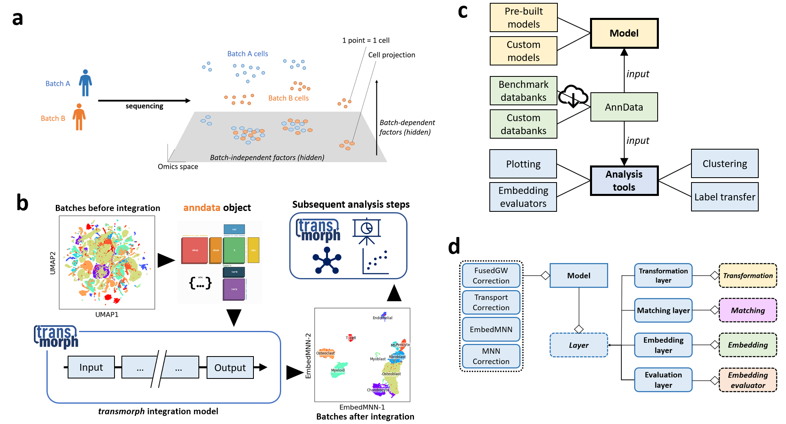

# [](https://transmorph.readthedocs.io/en/latest/index.html)

[](https://badge.fury.io/py/transmorph)
[](https://github.com/Risitop/transmorph/blob/main/LICENSE)
[](https://transmorph.readthedocs.io/en/latest/?badge=latest)
[](https://pepy.tech/project/transmorph)
[](https://pepy.tech/project/transmorph)

**transmorph** is a python framework dedicated to data integration, with a focus on single-cell applications. Dataset integration describes the problem of embedding two or more datasets together, across different batches or feature spaces, so that similar samples end up close from one another. In transmorph we aim to provide a comprehensive framework to design, apply, report and benchmark data integration models using a system of interactive building blocks supported by statistical and plotting tools. We included pre-built models as well as benchmarking databanks in order to easily set up integration tasks. This package can be used in compatibility with **scanpy** and **anndata** packages, and works in jupyter notebooks.



Transmorph is also computationally efficient, and can scale to large datasets with competitive integration quality. 

## Documentation

https://transmorph.readthedocs.io/en/latest/

## Installation

**transmorph** can be installed either from source of from the python repository PyPi. PyPi version is commonly more stable, but may not contain latest features, while you can find the development version on GitHub. Using a python environment is highly recommended (for instance  [pipenv](https://pypi.org/project/pipenv/)) in order to easily handle dependencies and versions. **transmorph** has only be tested for python >=3.9, on Linux and Windows systems.

See the instructions: [https://transmorph.readthedocs.io/en/latest/sections/installation.html](https://transmorph.readthedocs.io/en/latest/sections/installation.html)

### Quick starting with a pre-built model

All **transmorph** models take a list or a dictionary containing AnnData objects as input
for data integration. Let us start by loading some benchmarking data, gathered from [Chen 2020] (3.4GB size).

```python
from transmorph.datasets import load_chen_10x
chen_10x = load_chen_10x()
```

One can then either create a custom integration model, or load 
a pre-built transmorph model. We will choose the *EmbedMNN* model with
default parameters for this example, which embeds all datasets into 
a common abstract 2D space. 

```python
from transmorph.models import EmbedMNN
model = EmbedMNN()
model.transform(chen_10x)
```

Integration embedding coordinates can be gathered in each AnnData object,
in AnnData.obsm['X_transmorph'].

```python
chen_10x['P01'].obsm['X_transmorph']
```

One can for instance use a plotting function from transmorph to display integration results.

```python
from transmorph.utils.plotting import scatter_plot

scatter_plot(chen_10x, use_rep="transmorph")
scatter_plot(chen_10x, use_rep="transmorph", color_by="class")
```

[Chen 2020] [Chen, Y. P., Yin, J. H., Li, W. F., Li, H. J., Chen, D. P., Zhang, C. J., ... & Ma, J. (2020). Single-cell transcriptomics reveals regulators underlying immune cell diversity and immune subtypes associated with prognosis in nasopharyngeal carcinoma. Cell research, 30(11), 1024-1042.](https://www.nature.com/articles/s41422-020-0374-x)

## Citing transmorph

If you find transmorph useful for your research, please consider citing our pre-print
which can be found on [bioRxiv](https://www.biorxiv.org/content/10.1101/2022.11.02.514912v1).

```bibtex
@article{fouche2022transmorph,
  title={transmorph: a unifying computational framework for single-cell data integration},
  author={Fouch{\'e}, Aziz, Chadoutaud, Lo{\¨i}c, Delattre, Olivier and Zinovyev, Andrei},
  journal={bioRxiv},
  year={2022}
}
```
