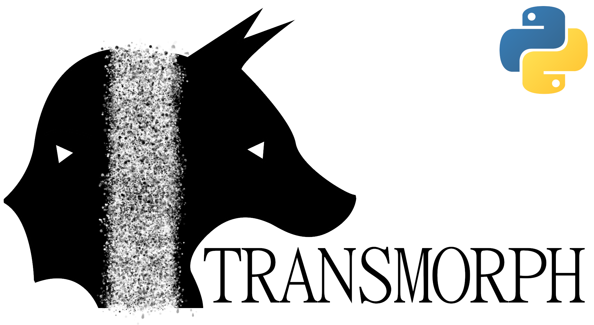

# Transmorph (anciently WOTi)

[](https://badge.fury.io/py/transmorph)



**Transmorph** is a python toolbox dedicated to transportation theory-based
data analysis. Originally consisting in a data integration pipeline
based on optimal transport and correcting for density, we are now adding 
extra features relevant in single-cell data analysis such as label transfer 
(already implemented), applications of Wasserstein barycenters, trajectory 
analysis and more.

***Warning:*** This package is still in a very early stage of its
development. Feel free to open an issue in case of unexpected behvior.

## Installation

### Requirements

These packages should be installed automatically by pip.
+ numpy 
+ scipy 
+ [osqp](https://github.com/osqp/osqp-python) (quadratic program solver)
+ [POT](https://github.com/PythonOT/POT) (optimal transport in python)

### Install from source (latest version)
```sh
git clone https://github.com/Risitop/transmorph
pip install ./transmorph
```

### Install from PyPi (recommended, latest stable version)

``` sh
pip install transmorph
```

## Usage

### Model fitting

We choose to adopt a philosophy similar to `sklearn`'s package, 
with a numerical method encapsulated in a python object. The main
class here is the `Transmorph`, and should be fitted prior to any 
analysis. First, you need to create a Transmorph object, selecting 
its parameters (transportation technique, entropic regularization,
density correction...).

``` python
import transmorph as tr

t = tr.Transmorph(method='ot')
```

You can then load your two datasets and fit the Transmorph. You can
provide extra arguments such as custom cost matrix (default is Euclidean
distance).

``` python
X, Y = ... # datasets, np.ndarrays
t.fit(X, Y)
```

### Data integration

Once the Transmorph is fitted, data integration is very straightforward through
the `transform` method, following ([Ferradans 2013](https://hal.archives-ouvertes.fr/hal-00797078/document))
methodology. 


``` python
X_integrated = t.transform()
```

### Label transfer

Label transfer can be carried out to transfer labels from a dataset to the other
in a semi-supervised fashion according to the optimal transport plan, following
([Taherkhani 2020](https://link.springer.com/chapter/10.1007/978-3-030-58548-8_30)).

```python
lY = ... # Gathering labels from Y dataset 
lX = t.label_transfer(lY)
```

## Examples

See three example notebooks in `examples/` directory.

## Reference

https://www.biorxiv.org/content/10.1101/2021.05.12.443561v1

## Documentation

Work in progress.
