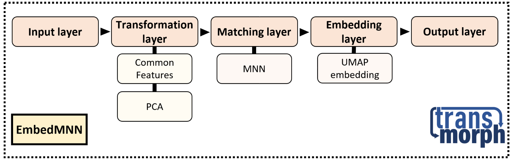
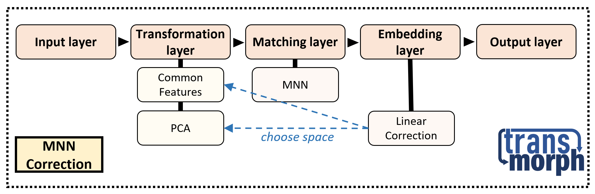
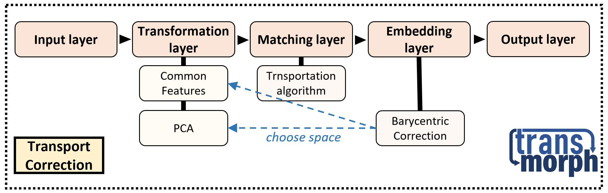

Pre-built models 
================

**transmorph** provides three pre-built models which allow to carry out data integration in different scenarios. This section describes, for each of them, its basic functioning as well as practical recommended use cases.

.. contents:: Contents
   :local:
   :backlinks: none
   :depth: 3

Low dimensional joint embedding with EmbedMNN
---------------------------------------------

EmbedMNN is a data integration pipeline which outputs a 2D or 3D joint embedding of all batches. It requires batches in input to be in overlapping spaces. This result can subsequently be used for plotting purposes to make interpretations and draw hypotheses, as well as for clustering and cell type inference. First of all, EmbedMNN projects all batches in their largest common gene space. Then, it performs dimensionality reduction using PCA on the set of batches, and uses this representation to carry out a matching algorithm between all pairs of batches (MNN inspired from :cite:p:`haghverdi2018batch` or batch KNN inspired from :cite:p:`polanski2020bbknn`). The last step is to build a joint graph of batches, combining matching edges with internal KNN edges, and weighting them following UMAP :cite:p:`becht2019dimensionality` so that for every cell in batch A, its strongest match in match B has weight 1. This joint graph is in the final step embedded in a 2D or 3D space using UMAP or MDE :cite:p:`agrawal2021minimum` optimizer.

.. autoclass:: models.EmbedMNN

Counts correction with MNNCorrection
------------------------------------

MNNCorrection is a data integration pipeline which outputs a corrected counts matrix or a corrected PCA matrix of all batches with respect to a reference batch. It requires batches in input to be in overlapping spaces. This model is inspired from Seurat :cite:p:`stuart2019comprehensive`, and works as follows. First of all, MNNCorrection projects all batches in their largest common genes space. Then, it performs PCA dimensionality reduction on the set of batches, and uses this representation to carry out a matching algorithm between all batches and the reference batch (MNN inspired from :cite:p:`haghverdi2018batch` or batch KNN inspired from :cite:p:`polanski2020bbknn`). It eventually computes correction vectors between cells and their estimated position in the reference batch, as the barycenter of their matches. Unmatched cells are then associated with the correction vector of the closest corrected cell, in the geodesic sense along the nearest neighbor graph. When all correction vectors are computed, cells are moved accordingly.

.. autoclass:: models.MNNCorrection

Optimal transport-based integration with TransportCorrection
------------------------------------------------------------

TransportCorrection is a data integration pipeline which outputs a corrected counts matrix or a corrected PCA matrix of all batches with respect to a reference batch. It is inspired from SCOT :cite:p:`demetci2020gromov`, and uses transportation theory to assess cell-cell similarity between batches, as introduced in :cite:p:`schiebinger2019optimal` to disentangle cell fate. Transportation theory is an optimization topic interested in finding the cheapest way to transport mass from a set of sources to a set of targets, cost being proportional to mass moved and distance traveled :cite:p:`peyre2019computational`. TransportCorrection requires a reference dataset, but does not in theory need batches to be in overlapping spaces (for instance, non-intersecting gene expression spaces, or vertical integration between technologies like ATAC-seq vs RNA-seq, given a cost matrix can be provided). If no explicit cost matrix is provided, and batches can be expressed in a common gene space, a dissimilarity metric can be used as cost. Otherwise, if every batch representation can be endowed with a dissimilarity metric, the Gromov-Wasserstein problem can be solved instead of optimal transport in order to guess inter-batch matchings. The final step consists in projecting every cell to the barycenter of its matches in the reference space.

.. autoclass:: models.TransportCorrection

Bibliography
------------

.. bibliography::
